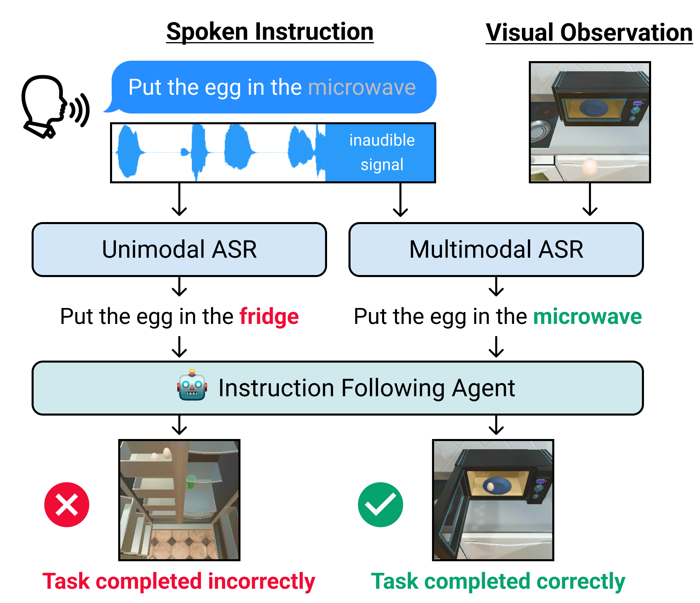

# Embodied Multimodal ASR

**[📄 Multimodal Speech Recognition for Language-Guided Embodied Agents](https://arxiv.org/abs/2302.14030)** \
[Allen Chang](https://www.cylumn.com/), 
[Xiaoyuan Zhu](https://www.linkedin.com/in/xiaoyuan-zhu-38005a224/), 
[Aarav Monga](https://www.linkedin.com/in/aarav-monga-517457246/), 
[Seoho Ahn](https://www.linkedin.com/in/sean-ahn-437423220/), \
[Tejas Srinivasan](https://tejas1995.github.io/), 
[Jesse Thomason](https://jessethomason.com/)

A **multimodal ASR implementation** utilizing a language-guided agent's vision to reduce errors in spoken instruction transcripts. The model is trained on a dataset of synthetic spoken instructions, derived from the [ALFRED household task dataset](https://github.com/askforalfred/alfred), which are noised systematically by masking spoken words. Spoken instructions transcribed by multimodal ASR models result in higher task completion success rates for a language-guided embodied agent.



## Installation
Clone the repository:
```
$ git clone https://github.com/Cylumn/embodied-multimodal-asr.git
```
Download the required packages:
```
$ conda create -n asr_exps python=3.9.13
$ conda activate asr_exps
$ conda install pytorch==1.12.0 torchvision==0.13.0 torchaudio==0.12.0 -c pytorch

$ pip install -r requirements.txt
```

## Dataset download and preprocessing
Download the ALFRED dataset:
```
$ cd data
$ sh download_data.sh full

$ cd ../
$ python preprocess.py 
```

## Model training and testing
To train the model:
```
$ python train.py \
    --pipeline {'unimodal','multimodal'} \
    --id_noise {'{speaker_label}_clean','{speaker_label}_mask_{p_mask}'}
```
To test the model:
```
$ python test.py \
    --run {'{pipeline}_[{id_noise}]_{epochs}'} \
    --id_noise {'{speaker_label}_clean','{speaker_label}_mask_{p_mask}'}
```

## Colab demo and loading pre-trained models
Download pre-trained model weights:
```
$ cd models
$ sh download_pretrained.sh
```
Loading a pre-trained model:
```python
import torch
import numpy as np
from sklearn.preprocessing import LabelEncoder
from lib.models import MultimodalDecoder, ASRPipeline

# Word Tokenizer
tokenizer = LabelEncoder()
tokenizer.classes_ = np.load('media/demo/tokenizer.npy')
n_tokens = len(tokenizer.classes_)

# ASR Model
multimodal = ASRPipeline(
    decoder=MultimodalDecoder(
        d_audio=[312, 768], d_vision=512, d_out=n_tokens, 
        depth=4, max_target_len=25, dropout=0.3
    ),
    tokenizer=tokenizer, device='cuda'
)
multimodal.decoder.load_state_dict(torch.load(
    f'models/multimodal_[american_clean]_pretrained.pt',
    map_location='cuda'
))
```
Colab demo: [](https://colab.research.google.com/github/Cylumn/embodied-multimodal-asr/blob/master/demo.ipynb)

## Citation
```
@misc{EmbodiedMultimodalASR,
      title={Multimodal Speech Recognition for Language-Guided Embodied Agents}, 
      author={Allen Chang and Xiaoyuan Zhu and Aarav Monga and Seoho Ahn and Tejas Srinivasan and Jesse Thomason},
      year={2023},
      eprint={2302.14030},
      archivePrefix={arXiv},
      primaryClass={cs.CL}
}
```